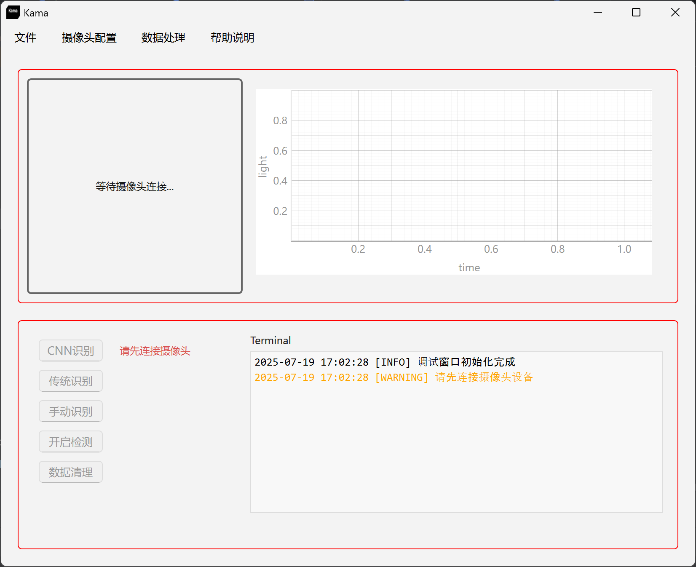
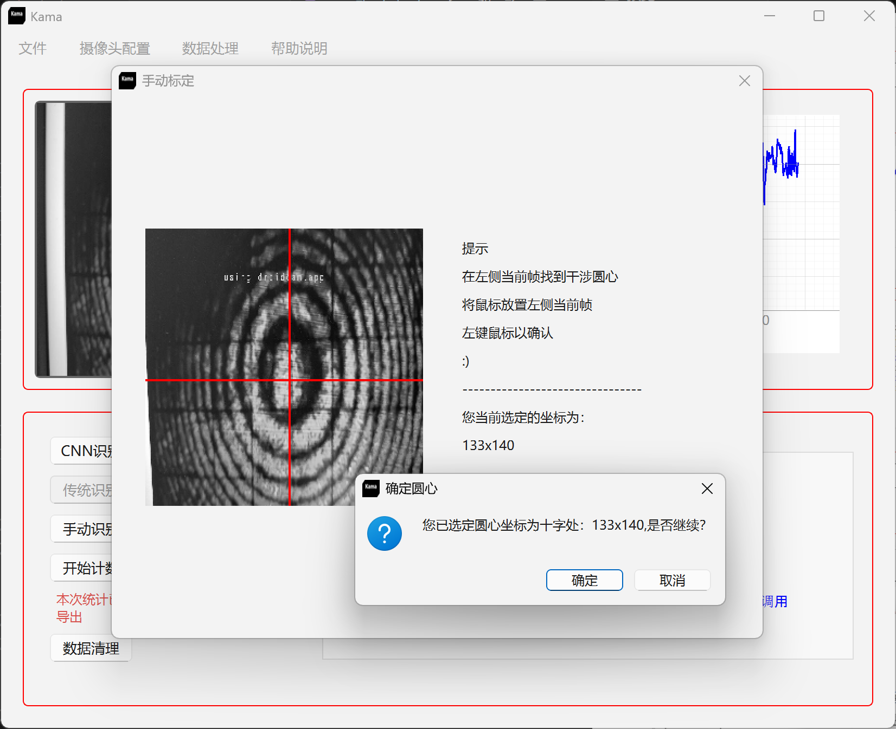
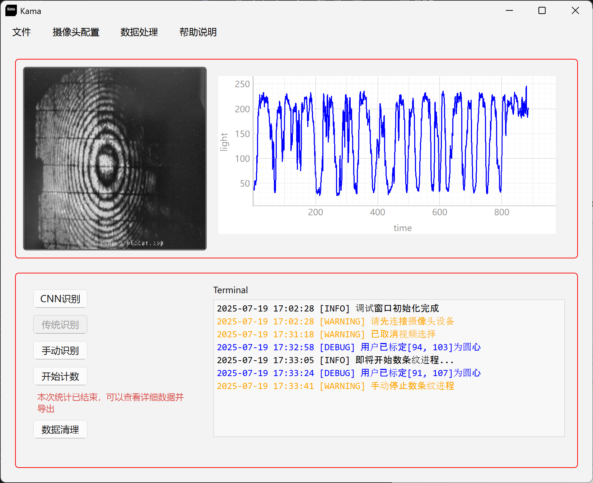
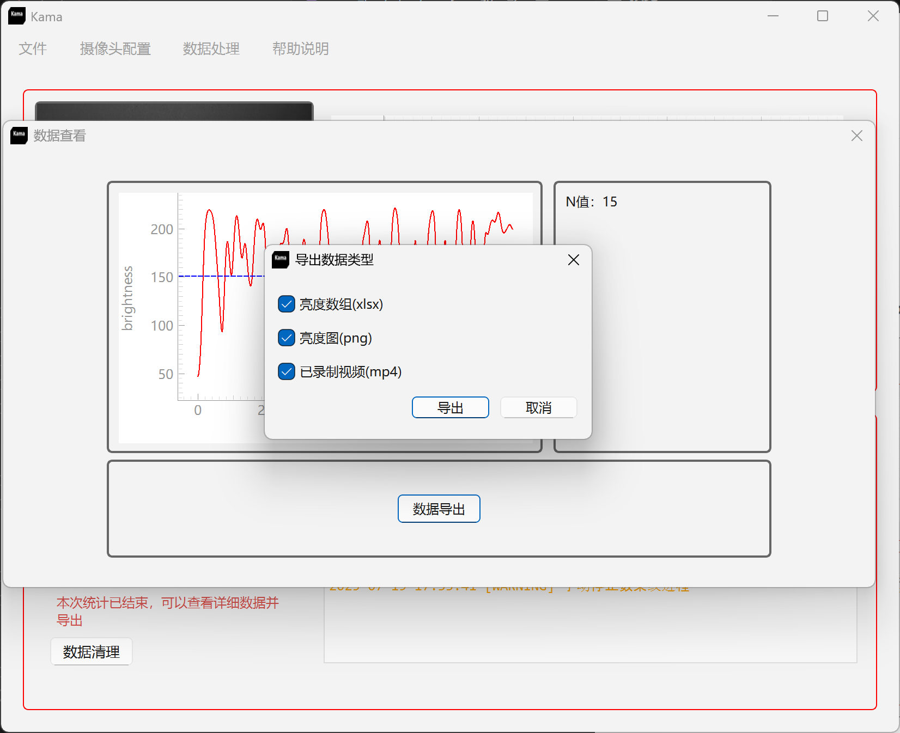

# Kama

  
  

## 概述

Kama是一款专为<u>迈克尔逊干涉条纹计数</u>设计的跨平台桌面软件。

它能够进行**实时捕捉**、**处理**和**数据分析**。

<table>
  <tr>
    <td width="50%">
      
    </td>
    <td width="50%">
      
    </td>
  </tr>
  <tr>
    <td width="50%">
      
    </td>
    <td width="50%">
      
    </td>
  </tr>
</table>

## 项目亮点

- **项目工程化程度高**
  
  代码结构清晰，严格遵循了高内聚，低耦合的编程实践。

- **软件稳定高效**
  
  通过原生Qt、Qthread多线程等的支持，软件在数据处理和实时分析方面具有很好的支持。

- **基于基本原理的创新**
  
  本项目基于openCV等基础库，我在详细了解了openCV的算法封装的基础上进行算法创新与改进，这让我学到了很多！

## 特性

- **圆环中心检测**: 基于<u>OpenCV</u>的传统算法检测干涉圆环中心。

- **实时图像采集**: 从[IP摄像头](https://en.wikipedia.org/wiki/IP_camera)捕获实时图像进行实时观察。

- **亮度分析计数**: 基于亮度分析的计数方法，结果稳定，精确度高。

- **数据可视化**: 基于[pyqtgraph](https://www.pyqtgraph.org/)显示计数结果。

- **交互式界面**: GUI由高性能GUI框架[Qt](https://doc.qt.io/qtforpython-6/)提供支持。

## 技术栈

- **编程语言**: Python
- **图像处理**: OpenCV
- **GUI 框架**: PyQt
- **算法支持**: Numpy, Scipy

## 其他

[这里](https://kama.2jone.top/)是Kama的官方网站，您可以在这里获取获取关于此软件的详细信息，包括详细的技术栈，和帮助文档等。 :)

点击[这里](https://github.com/lavanceeee/interference-ring-iden)了解我如何实现了中心寻找算法，以及原码。
